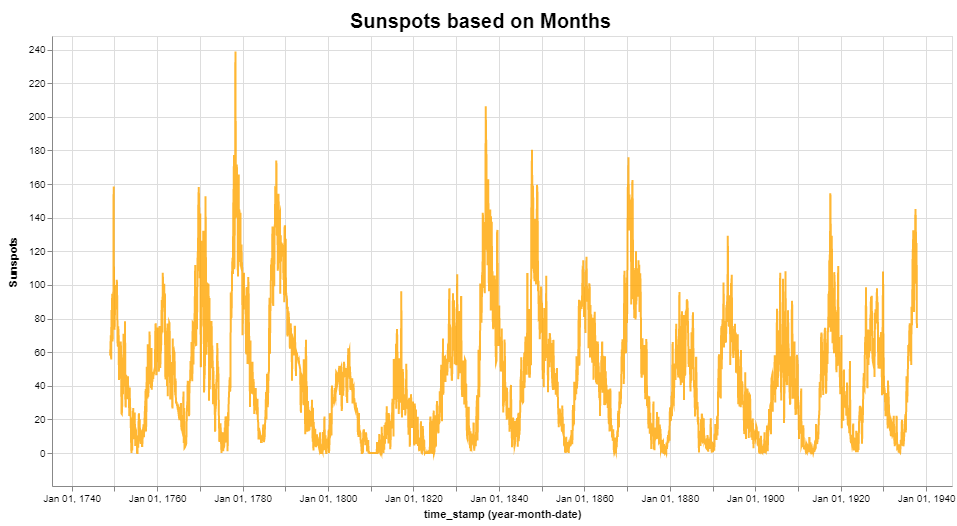
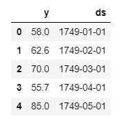
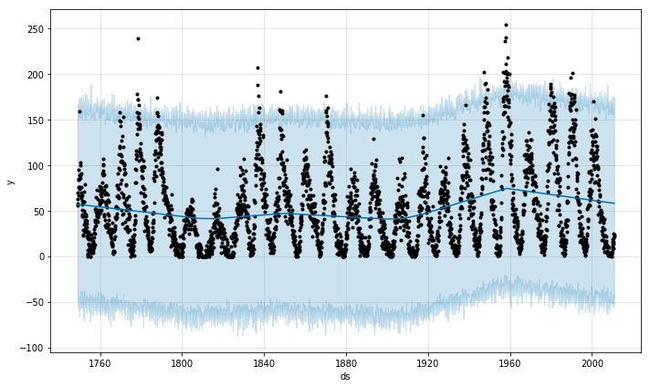
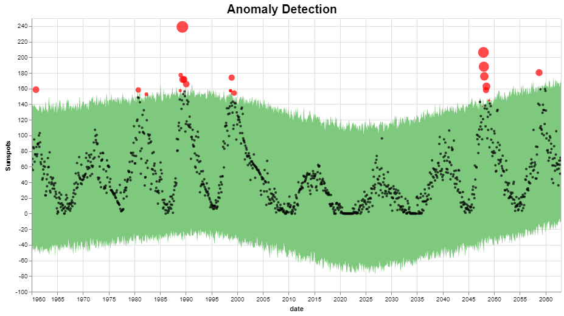

# Anomaly detection using Prophet and Altair

## View/Fork on [Kaggle](https://www.kaggle.com/vinayjaju/anomaly-detection-using-facebook-s-prophet?scriptVersionId=15216678)

**Packages-used:** [fbprophet](https://facebook.github.io/prophet/docs/installation.html#installation-in-python) and [altair](https://altair-viz.github.io/getting_started/installation.html#quick-start-altair-jupyterlab)


## Data Used: 

Data on sunspots since 1749: [Sunspots.txt](http://www-personal.umich.edu/~mejn/cp/data/sunspots.txt)




## Using Prophet:
* Prophet expects data to have two columns
    * Timestamp/Date - ds
    * Variable to check for Anomaly/Forecasting - y

    


### Fit and Predict:

```
def fit_predict_model(dataframe, interval_width = 0.99, changepoint_range = 0.8):
    m = Prophet(daily_seasonality = False, yearly_seasonality = False, 
                weekly_seasonality = False, 
                seasonality_mode = 'multiplicative', 
                interval_width = interval_width,
                changepoint_range = changepoint_range)
    
    m = m.fit(dataframe)
    
    forecast = m.predict(dataframe)
    forecast['fact'] = dataframe['y'].reset_index(drop = True)
    
    print('Displaying Prophet plot')
    fig1 = m.plot(forecast)

    return forecast
    
pred = fit_predict_model(clean_df)
```



### Detecting Anomalies:
* The light blue boundaries in the above graph are yhat_upper and yhat_lower.
* If y value is greater than yhat_upper and less than yhat lower then it is an anomaly.
* Also getting the importance of that anomaly based on its distance from yhat_upper and yhat_lower.
```
def detect_anomalies(forecast):
    forecasted = forecast[['ds','trend', 'yhat', 'yhat_lower', 'yhat_upper', 'fact']].copy()
    #forecast['fact'] = df['y']

    forecasted['anomaly'] = 0
    forecasted.loc[forecasted['fact'] > forecasted['yhat_upper'], 'anomaly'] = 1
    forecasted.loc[forecasted['fact'] < forecasted['yhat_lower'], 'anomaly'] = -1

    #anomaly importances
    forecasted['importance'] = 0
    forecasted.loc[forecasted['anomaly'] ==1, 'importance'] = \
        (forecasted['fact'] - forecasted['yhat_upper'])/forecast['fact']
    forecasted.loc[forecasted['anomaly'] ==-1, 'importance'] = \
        (forecasted['yhat_lower'] - forecasted['fact'])/forecast['fact']
    
    return forecasted

pred = detect_anomalies(pred)
```

### Visualize the results:

